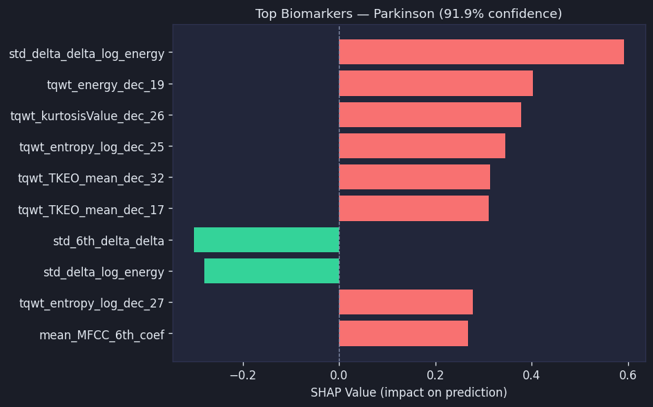

<div align="center">

# NeuroLynk — Interoperable Healthcare AI Agent for Parkinson's Speech Screening

### Explainable · FHIR-Native · Multi-Agent · Hackathon-Ready

[](https://colab.research.google.com/github/nishnarudkar/NeuroLynk-AI/blob/main/notebooks/Parkinsons_Detection_MLOPS_Project_SMOTE.ipynb)
&nbsp;
[](https://www.python.org/)
[](https://fastapi.tiangolo.com/)
[](https://xgboost.readthedocs.io/)
[](https://shap.readthedocs.io/)
[](https://hl7.org/fhir/)
[](https://openai.com/)
[](https://mlflow.org/)
[](https://dvc.org/)
[](https://www.docker.com/)
[](https://www.jenkins.io/)

<br/>

> **An interoperable healthcare AI agent that screens for Parkinson's disease from speech biomarkers — producing explainable predictions, LLM-generated clinical summaries, and FHIR R4 DiagnosticReports in a single API call.**

<br/>

**Built for the [Prompt Opinion Hackathon](https://devpost.com) on Devpost**

</div>

---

## Author

<div align="center">

**Nishant Narudkar** &nbsp;·&nbsp; [@nishnarudkar](https://github.com/nishnarudkar)

</div>

---

## Table of Contents

- [What It Does](#what-it-does)
- [Agent Workflow](#agent-workflow)
- [Architecture](#architecture)
- [Agent Endpoints](#agent-endpoints)
- [FHIR Output](#fhir-output)
- [Explainability](#explainability-shap)
- [LLM Clinical Summary](#llm-clinical-summary)
- [Dataset](#dataset)
- [Model Results](#model-results)
- [ML Pipeline](#ml-pipeline)
- [MLOps Stack](#mlops-stack)
- [Web Application](#web-application)
- [Drift Monitoring](#drift-monitoring)
- [API Reference](#api-reference)
- [Installation & Setup](#installation--setup)
- [Running the Project](#running-the-project)
- [Docker Deployment](#docker-deployment)
- [CI/CD with Jenkins](#cicd-with-jenkins)
- [Technology Stack](#technology-stack)
- [Disclaimer](#disclaimer)

---

## What It Does

Parkinson's disease affects 10 million people worldwide. Diagnosis today takes years — neurologist visits, motor tests, specialist referrals. But Parkinson's leaves a measurable fingerprint in the human voice long before motor symptoms appear.

NeuroLynk is a healthcare AI agent that finds it — and explains why.

A single `POST /agent/screen` call accepts 753 vocal biomarkers and runs them through a three-agent pipeline:

| Agent | Responsibility | Output |
|-------|---------------|--------|
| **Speech Screening Agent** | XGBoost prediction + SHAP extraction | Probability score + top-5 biomarker contributions |
| **Clinical Summary Agent** | LLM narrative generation | 3–5 sentence clinician-readable summary |
| **FHIR Report Agent** | Healthcare standards formatting | FHIR R4 DiagnosticReport with SNOMED CT codes |

All three outputs are returned simultaneously, with a session-addressable FHIR endpoint and a structured `platform_payload` for Prompt Opinion Platform consumption.

> ⚠️ This system is for research and educational demonstration only. It is not a validated clinical diagnostic tool.

---

## Agent Workflow

```
POST /agent/screen
        │
        ▼
┌─────────────────────────────────────────────────────┐
│  Agent_Orchestrator  (api/agent.py)                 │
│                                                     │
│  ┌─────────────────────────────────────────────┐   │
│  │  Agent 1 — Speech Screening                 │   │
│  │  select → scale → XGBoost → SHAP            │   │
│  │  753 features → prediction + top-5 SHAP     │   │
│  └──────────────────┬──────────────────────────┘   │
│                     │ PredictionResult              │
│                     │ list[BiomarkerContribution]   │
│                     ▼                               │
│  ┌─────────────────────────────────────────────┐   │
│  │  Agent 2 — Clinical Summary                 │   │
│  │  LLM prompt → 3–5 sentence clinical text    │   │
│  │  mock | openai | gemini via LLM_PROVIDER    │   │
│  │  Non-fatal: fallback string on any failure  │   │
│  └──────────────────┬──────────────────────────┘   │
│                     │ clinical_summary: str         │
│                     ▼                               │
│  ┌─────────────────────────────────────────────┐   │
│  │  Agent 3 — FHIR Report                      │   │
│  │  FHIR R4 DiagnosticReport                   │   │
│  │  SNOMED CT codes + Observation resources    │   │
│  └──────────────────┬──────────────────────────┘   │
│                     │ fhir_report: dict             │
│                     ▼                               │
│  Assemble ScreeningResult + platform_payload        │
│  Store in SessionStore (FIFO, 100-cap)              │
└─────────────────────────────────────────────────────┘
        │
        ▼
   ScreeningResult  (JSON)
   ├── prediction + probability
   ├── top_contributions  (SHAP)
   ├── clinical_summary   (LLM)
   ├── fhir_report        (DiagnosticReport)
   ├── platform_payload   (Prompt Opinion handoff)
   └── agent_metadata     (steps + duration + version)
```

Single FastAPI process. No message queues. No distributed systems. Sequential async calls — sub-400ms end-to-end (excluding LLM latency).

---

## Architecture

```
┌──────────────────────────────────────────────────────────────────┐
│                         DATA LAYER                               │
│   pd_speech_features.csv  ──►  DVC  ──►  DagsHub Remote         │
└─────────────────────────────────┬────────────────────────────────┘
                                  │
┌─────────────────────────────────▼────────────────────────────────┐
│                      TRAINING PIPELINE                           │
│   SelectFromModel(RF)  ──►  StandardScaler  ──►  ImbPipeline     │
│   753 → 100 features                                             │
│   6 Models × RandomizedSearchCV × StratifiedKFold(5)            │
│   XGBoost ──► MLflow Registry ──► DagsHub                       │
└─────────────────────────────────┬────────────────────────────────┘
                                  │
┌─────────────────────────────────▼────────────────────────────────┐
│                      AGENT LAYER  (new)                          │
│   api/agent.py          Agent_Orchestrator + SessionStore        │
│   api/summariser.py     Clinical_Summariser (mock/openai/gemini) │
│   api/fhir_formatter.py FHIR_Formatter (pure, no I/O)            │
└─────────────────────────────────┬────────────────────────────────┘
                                  │
┌─────────────────────────────────▼────────────────────────────────┐
│                       SERVING LAYER                              │
│   FastAPI  ──►  /predict  (existing, unchanged)                  │
│   FastAPI  ──►  /agent/*  (new agent endpoints)                  │
│   7-tab dark UI including 🤖 AI Agent tab                        │
└─────────────────────────────────┬────────────────────────────────┘
                                  │
┌─────────────────────────────────▼────────────────────────────────┐
│                     MONITORING LAYER                             │
│   /predict logs ──► current_data.csv                            │
│   drift_check.py ──► Evidently KS test ──► Drift Monitor tab    │
└──────────────────────────────────────────────────────────────────┘
```

---

## Agent Endpoints

| Method | Path | Description |
|--------|------|-------------|
| `POST` | `/agent/screen` | Run full 3-agent workflow, returns `ScreeningResult` |
| `GET` | `/agent/report/{session_id}` | FHIR DiagnosticReport (`Content-Type: application/fhir+json`) |
| `GET` | `/agent/health` | Subsystem liveness for all three agents |
| `GET` | `/agent/schema` | Machine-readable agent contract (A2A-compatible) |

All existing endpoints (`/predict`, `/health`, `/feature-defaults`, `/model-comparison`, `/drift-status`, `/top-features`) remain unchanged.

CORS is enabled on all `/agent/*` routes for cross-origin platform consumption.

---

## FHIR Output

Every screening produces a FHIR R4 DiagnosticReport independently retrievable by session ID:

```json
{
  "resourceType": "DiagnosticReport",
  "id": "3f7a1b2c-4d5e-6f7a-8b9c-0d1e2f3a4b5c",
  "status": "final",
  "code": {
    "coding": [{ "system": "http://loinc.org", "code": "11488-4", "display": "Consult note" }]
  },
  "issued": "2026-05-09T14:32:11.847291+00:00",
  "performer": [{ "display": "Parkinson Speech Screening AI Agent" }],
  "conclusion": "Parkinson's Detected (confidence: 0.8765)",
  "conclusionCode": [{
    "coding": [{ "system": "http://snomed.info/sct", "code": "49049000", "display": "Parkinson's disease" }]
  }],
  "result": [
    {
      "resourceType": "Observation",
      "id": "3f7a1b2c-obs-1",
      "status": "final",
      "code": { "text": "tqwt_TKEO_std_dec_13" },
      "valueQuantity": { "value": 0.3421, "unit": "SHAP value" }
    }
  ]
}
```

**SNOMED CT mapping:**
- `"Parkinson's Detected"` → `49049000` (Parkinson's disease)
- `"Healthy"` → `17621005` (Normal)

---

## Explainability (SHAP)

Model selection prioritised SHAP compatibility over raw performance. XGBoost was chosen over higher-scoring SVM and KNN because SHAP `TreeExplainer` provides **exact, fast feature attribution** — not kernel approximations. In clinical AI, you can't deploy what you can't explain.

Every prediction includes:
- Per-feature SHAP values (positive = toward Parkinson's, negative = toward Healthy)
- Visual horizontal bar chart in the UI (red/green dark theme)
- LLM narrative referencing actual biomarker names and directional impact
- FHIR `Observation` resources encoding each contribution




---

## LLM Clinical Summary

Provider-agnostic via `LLM_PROVIDER` environment variable:

| Value | Behaviour |
|-------|-----------|
| `mock` | Deterministic offline summary — no API key needed |
| `openai` | GPT-4o-mini via `AsyncOpenAI` client |
| `gemini` | Extensible — add `_call_gemini()` to `api/summariser.py` |

**Example output (mock mode):**
```
The screening model classified this sample as Parkinson's Detected. The analysis
identified elevated SHAP contributions from several speech biomarkers, suggesting
irregular vocal patterns consistent with Parkinsonian speech characteristics. Key
features showed positive SHAP values, indicating their influence toward the
Parkinson's classification. These findings reflect measurable changes in speech
dynamics that the model associates with the condition.
This result is for research purposes only and does not constitute a medical diagnosis.
```

**Safety design:**
- 8-second timeout with automatic fallback string
- LLM failure is **non-fatal** — FHIR report and prediction always returned
- Mandatory disclaimer injected as a hard prompt constraint, not UI text
- Empty/whitespace-only LLM responses trigger the fallback string

---

## Dataset

| Property | Value |
|----------|-------|
| File | `data/pd_speech_features.csv` |
| Samples | 756 rows |
| Raw features | 753 speech biomarkers |
| Selected features | 100 (by Random Forest importance) |
| Target | Binary — `1` = Parkinson's, `0` = Healthy |
| Class distribution | 564 Parkinson's (74.6%) / 192 Healthy (25.4%) |

### Feature Groups

| Group | Description |
|-------|-------------|
| `mean_MFCC_*` | Mel-frequency cepstral coefficients (0–12) |
| `tqwt_TKEO_*`, `tqwt_entropy_*` | Tunable Q-factor Wavelet Transform features |
| `locPctJitter`, `localShimmer` | Jitter and shimmer — frequency/amplitude variation |
| `PPE`, `DFA`, `RPDE` | Nonlinear dynamical complexity measures |
| `f1`–`f4`, `b1`–`b4` | Formant frequencies and bandwidths |

---

## Model Results

| Model | Accuracy | Macro F1 | ROC AUC | Selected |
|-------|----------|----------|---------|----------|
| SVM | 0.895 | 0.854 | 0.964 | |
| KNN | 0.882 | 0.858 | 0.950 | |
| **XGBoost** | **0.882** | **0.836** | **0.943** | ★ Production |
| Random Forest | 0.862 | 0.817 | 0.919 | |
| Decision Tree | 0.849 | 0.809 | 0.818 | |
| Logistic Regression | 0.829 | 0.783 | 0.830 | |

All metrics are macro-averaged on the held-out test set (152 samples).
XGBoost selected for SHAP `TreeExplainer` compatibility — interpretability was a hard constraint.

---

## ML Pipeline

### Preprocessing order: select → scale

```python
# Feature selection (SMOTE applied first so RF learns minority class)
selector = SelectFromModel(RandomForestClassifier(n_estimators=100), max_features=100)
selector.fit(X_train_smote, y_train_smote)   # 753 → 100 features

# Scaling (fitted only on training data)
scaler = StandardScaler()
scaler.fit(X_train_sel)
```

### SMOTE inside CV folds (no leakage)

```python
pipeline = ImbPipeline([
    ("smote", SMOTE(random_state=42)),
    ("model", XGBClassifier()),
])
RandomizedSearchCV(pipeline, param_dist, cv=StratifiedKFold(5), scoring="f1_macro")
```

Validation folds always contain real, unaugmented data.

---

## MLOps Stack

| Tool | Role |
|------|------|
| MLflow 3.10 | Experiment tracking, model registry (remote: DagsHub) |
| DVC 3.67 | Data versioning, pipeline reproducibility |
| DagsHub | Remote storage for MLflow + DVC |
| Evidently 0.7 | Data drift detection (KS test) |
| Docker | Multi-stage container build (runtime uses `requirements-api.txt`) |
| Jenkins | 7-stage CI/CD pipeline (Windows agent) |

### DVC Pipeline

```yaml
stages:
  train:          python src/train.py          → models/*.pkl
  explain:        python src/explain.py         → static/feature_importance.png
  learning_curve: python src/learning_curve.py  → static/learning_curve.png
```

---

## Web Application

Seven-tab dark-themed UI served by FastAPI + Jinja2:

| Tab | Content |
|-----|---------|
| 📊 Feature Importance | Global SHAP chart + top 5 biomarkers |
| 📈 Learning Curve | Bias-variance plot with confidence bands |
| 🔬 Prediction | 5-input form + result card + SHAP explanation |
| 📋 Model Comparison | Live leaderboard from MLflow metrics |
| 🔎 Feature Insights | Biomarker analysis — Parkinson's vs. Healthy means |
| 📡 Drift Monitor | Live drift dashboard — status, chart, feature table |
| 🤖 AI Agent | Clinical summary + SHAP chart + FHIR JSON + metadata |

---

## Drift Monitoring

Production inputs are logged to `monitoring/current_data.csv` on every `/predict` call. Running `python monitoring/drift_check.py` compares against the training baseline using the Kolmogorov-Smirnov test.

- Feature drifted when KS p-value < 0.05
- Retraining recommended when > 50% of features drift
- Results served live via `GET /drift-status` → Drift Monitor tab

---

## API Reference

### Agent Endpoints

#### `POST /agent/screen`
```json
// Request
{ "features": [753 floats in column_order] }

// Response (abbreviated)
{
  "session_id": "3f7a1b2c-...",
  "prediction": 1,
  "label": "Parkinson's Detected",
  "probability": 0.8765,
  "top_contributions": [
    { "feature_name": "tqwt_TKEO_std_dec_13", "impact": 0.3421 }
  ],
  "clinical_summary": "The screening model classified...",
  "fhir_report": { "resourceType": "DiagnosticReport", "..." },
  "platform_payload": {
    "session_id": "3f7a1b2c-...",
    "prediction_label": "Parkinson's Detected",
    "confidence_pct": 87.7,
    "top_biomarkers": [...],
    "clinical_summary": "...",
    "fhir_report_url": "/agent/report/3f7a1b2c-..."
  },
  "agent_metadata": {
    "agent_version": "1.0.0-hackathon",
    "model_type": "XGBClassifier",
    "explainer_type": "TreeExplainer",
    "workflow_steps": ["input_validation","prediction","shap_extraction","clinical_summary","fhir_formatting","result_assembly"],
    "total_duration_ms": 312
  }
}
```

#### `GET /agent/report/{session_id}`
Returns FHIR R4 DiagnosticReport JSON with `Content-Type: application/fhir+json`.
Returns HTTP 404 with `{"error": "Session not found", "session_id": "..."}` if not found.

#### `GET /agent/health`
```json
{
  "status": "ok",
  "subsystems": {
    "prediction_pipeline": { "status": "ok", "model_loaded": true },
    "fhir_formatter": { "status": "ok" },
    "llm_summariser": { "status": "ok", "provider": "mock", "reachable": true }
  }
}
```

#### `GET /agent/schema`
Returns Pydantic JSON schema for `AgentScreenRequest` and `ScreeningResult`.

### Existing Endpoints

#### `GET /health`
```json
{ "status": "ok", "model": "XGBClassifier", "explainer": "TreeExplainer", "model_loaded": true }
```

#### `POST /predict`
```json
// Request
{ "features": [753 floats] }

// Response
{
  "prediction": 1,
  "label": "Parkinson's Detected",
  "probability": 0.923,
  "top_contributions": [
    { "feature_index": 42, "feature_name": "tqwt_kurtosisValue_dec_5", "impact": 0.2341 }
  ],
  "shap_bar_url": "/static/shap_bar.png"
}
```

---

## Installation & Setup

```bash
# 1. Clone
git clone https://github.com/nishnarudkar/NeuroLynk-AI.git
cd NeuroLynk-AI

# 2. Virtual environment
python -m venv venv
venv\Scripts\activate        # Windows
# source venv/bin/activate   # Linux / macOS

# 3. Install dependencies
pip install -r requirements.txt

# 4. Configure environment
copy .env.example .env
# Edit .env — set DAGSHUB_USERNAME, DAGSHUB_TOKEN
# LLM_PROVIDER=mock works offline with no API key

# 5. Pull dataset
dvc pull
```

---

## Running the Project

### Option A — DVC pipeline (recommended)

```bash
dvc repro
uvicorn api.main:app --host 0.0.0.0 --port 8000
```

### Option B — Step by step

```bash
python src/train.py
python src/explain.py
python src/learning_curve.py
uvicorn api.main:app --host 0.0.0.0 --port 8000
```

Open **http://localhost:8000** → 🤖 AI Agent tab → Run Agent Screen.

### Environment Variables

| Variable | Default | Description |
|----------|---------|-------------|
| `LLM_PROVIDER` | `mock` | `mock` · `openai` · `gemini` |
| `LLM_MODEL` | `gpt-4o-mini` | Model name passed to LLM API |
| `LLM_API_KEY` | — | API key (only for non-mock providers) |
| `LLM_TIMEOUT_SECONDS` | `8` | Seconds before LLM fallback triggers |
| `AGENT_VERSION` | `1.0.0-hackathon` | Reported in every `agent_metadata` |
| `AGENT_MAX_SESSIONS` | `100` | FIFO session store capacity |
| `DAGSHUB_USERNAME` | — | DagsHub username for MLflow/DVC |
| `DAGSHUB_TOKEN` | — | DagsHub token for MLflow/DVC |

---

## Docker Deployment

```bash
docker build -t neurolynk .
docker run -p 8000:8000 neurolynk
```

Multi-stage build — only `requirements-api.txt` dependencies in the runtime image.

---

## CI/CD with Jenkins

7-stage automated pipeline (Windows agent):

| Stage | Command |
|-------|---------|
| Install Dependencies | `pip install -r requirements.txt` |
| Pull Data (DVC) | `dvc pull data/pd_speech_features.csv.dvc --force` |
| Train Model | `python src/train.py` |
| Generate Explanations | `python src/explain.py` + `python src/learning_curve.py` |
| Smoke Test | `curl -f http://localhost:8000/health` |
| Build Docker Image | `docker build -t neurolynk .` |
| Drift Detection | `python monitoring/drift_check.py` |

---

## Technology Stack

| Category | Tools |
|----------|-------|
| ML / Data | scikit-learn 1.8, XGBoost 3.2, pandas 2.3, numpy 2.4, imbalanced-learn 0.14 |
| Explainability | SHAP 0.51 (TreeExplainer + KernelExplainer) |
| LLM | OpenAI 1.82 (AsyncOpenAI, GPT-4o-mini) |
| Healthcare Standards | FHIR R4, SNOMED CT, LOINC |
| Testing | Hypothesis 6.131 (property-based), pytest |
| Experiment Tracking | MLflow 3.10, DagsHub 0.6.9 |
| Data Versioning | DVC 3.67 |
| Drift Monitoring | Evidently 0.7 |
| Web Framework | FastAPI 0.135, Uvicorn 0.42, Jinja2 3.1, Pydantic 2.12 |
| Frontend | HTML5, CSS3, JavaScript, Chart.js (dark theme) |
| Infrastructure | Docker (multi-stage), Jenkins (7-stage CI/CD) |

---

## Project Structure

```
.
├── api/
│   ├── main.py              # FastAPI app — existing endpoints + agent integration
│   ├── agent.py             # Agent_Orchestrator, SessionStore, data models, router
│   ├── summariser.py        # Clinical_Summariser (mock/openai/gemini)
│   └── fhir_formatter.py    # FHIR_Formatter (pure, no I/O)
├── src/
│   ├── config.py            # Central path + dataset configuration
│   ├── train.py             # Training pipeline + MLflow logging
│   ├── explain.py           # SHAP global feature importance
│   ├── learning_curve.py    # Bias-variance analysis
│   ├── model_selection.py   # Interpretability-aware model selection
│   └── mlflow_comparison.py # MLflow metrics fetcher for UI
├── tests/
│   ├── test_unit.py         # 35 unit tests
│   ├── test_properties.py   # 11 Hypothesis property-based tests (P1–P10)
│   └── test_integration.py  # Integration tests for all agent endpoints
├── data/
│   └── pd_speech_features.csv      # Dataset (DVC tracked)
├── models/                          # Trained artifacts (gitignored)
├── monitoring/                      # Drift detection scripts + reports
├── static/                          # Frontend assets + generated charts
├── templates/
│   └── index.html                   # Jinja2 7-tab UI template
├── dvc.yaml                         # DVC pipeline definition
├── Dockerfile                       # Multi-stage container build
├── Jenkinsfile                      # 7-stage CI/CD pipeline
├── requirements.txt                 # Full pinned dependencies
├── requirements-api.txt             # API-only dependencies (Docker)
└── .env.example                     # Environment variables template
```

---

## Disclaimer

This project is intended for **research and educational demonstration purposes only**. It is not a validated medical diagnostic tool. Do not use predictions from this system for clinical decision-making. Always consult a qualified healthcare professional for medical advice.

Every output from this system includes the statement: *"This result is for research purposes only and does not constitute a medical diagnosis."*
