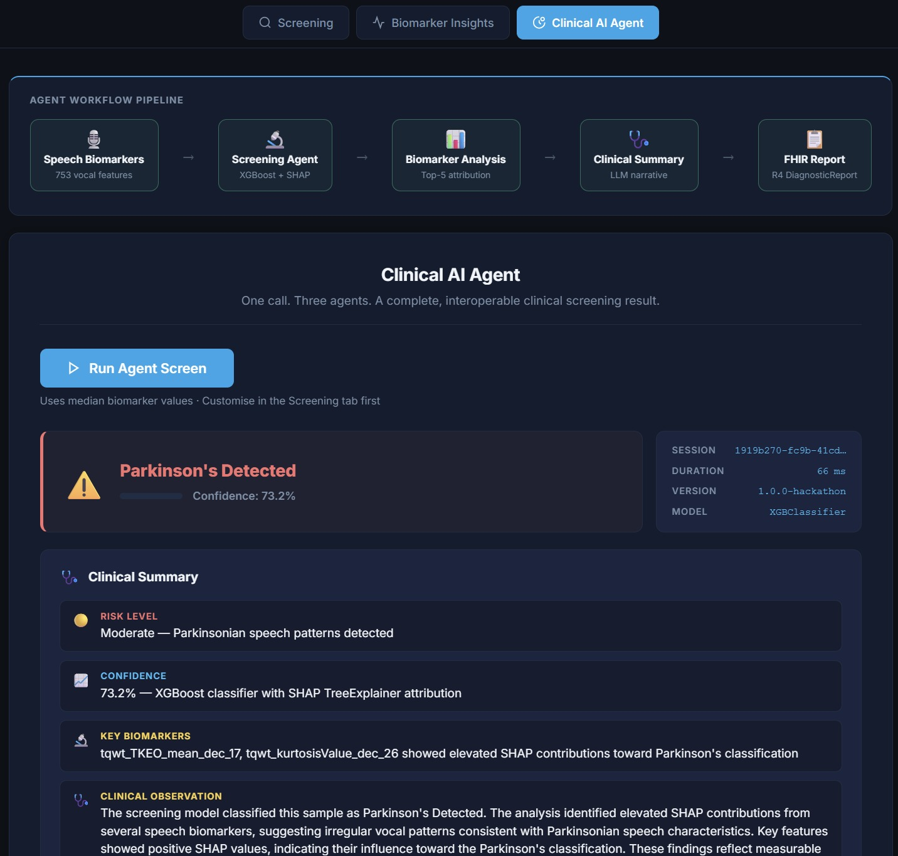
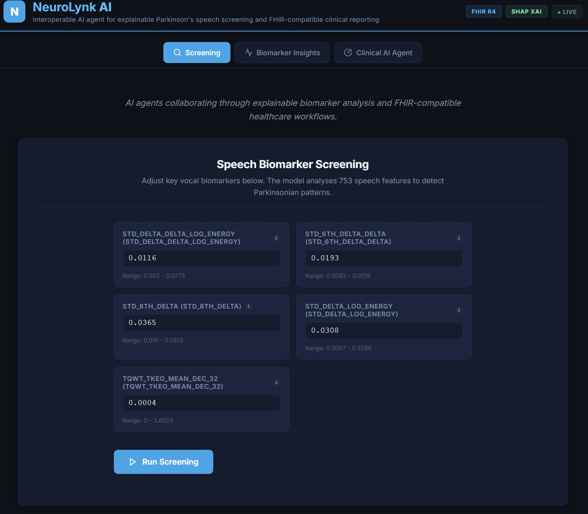
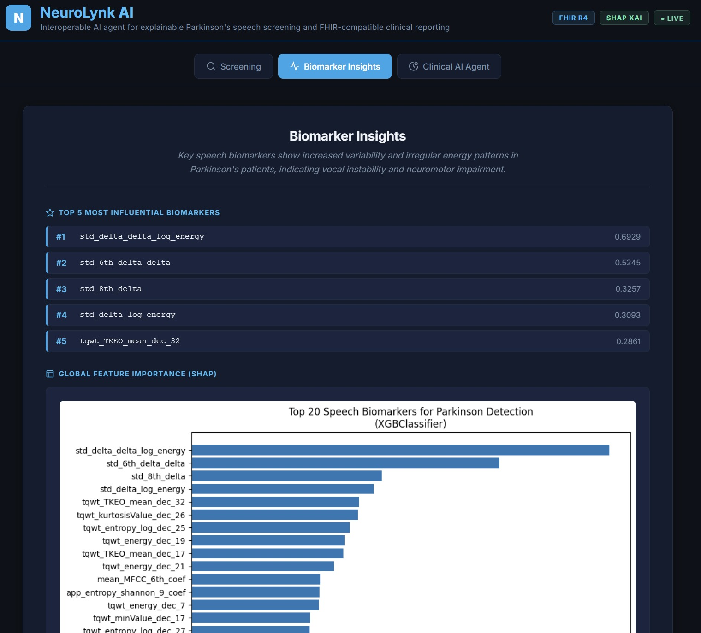

<div align="center">

# NeuroLynk AI
**Interoperable Healthcare AI Agent for Parkinson's Speech Screening**

Explainable | FHIR-Native | Multi-Agent | Hackathon-Ready

[](https://colab.research.google.com/github/nishnarudkar/NeuroLynk-AI/blob/main/notebooks/Parkinsons_Detection_MLOPS_Project_SMOTE.ipynb)
[](https://www.python.org/)
[](https://fastapi.tiangolo.com/)
[](https://xgboost.readthedocs.io/)
[](https://shap.readthedocs.io/)
[](https://hl7.org/fhir/)

<br/>

**An interoperable healthcare AI agent that screens for Parkinson's disease from speech biomarkers, producing explainable predictions, LLM-generated clinical summaries, and FHIR R4 DiagnosticReports in a single API call.**

Built for the **Agents Assemble: The Healthcare AI Endgame Challenge (Prompt Opinion Hackathon 2026)**.

</div>

---

## Overview

Parkinson's disease affects millions worldwide, yet diagnosis often takes years. NeuroLynk AI is designed to identify measurable anomalies in human speech long before severe motor symptoms appear. 

This platform serves as a multi-agent system where a single `POST /agent/screen` call orchestrates a comprehensive pipeline:

1. **Speech Screening Agent**: Analyses 753 vocal features using XGBoost, outputting a probability score and top-5 biomarker contributions via SHAP.
2. **Clinical Summary Agent**: Generates a clinician-readable narrative of the findings using Large Language Models.
3. **FHIR Report Agent**: Formats the analysis into a standard HL7 FHIR R4 DiagnosticReport mapped with SNOMED CT codes.



---

## Agent Protocol and Endpoints

NeuroLynk AI operates natively over the Agent-to-Agent (A2A) protocol. It supports the **SHARP Extension Spec**, enabling secure `patient_id` and `encounter_id` propagation from the Prompt Opinion platform down to the generated FHIR reports.

| Method | Path | Description |
|--------|------|-------------|
| `POST` | `/agent/screen` | Orchestrates the full 3-agent workflow. Supports SHARP Extension Context for patient linking. |
| `GET` | `/agent/report/{session_id}` | Retrieves the FHIR DiagnosticReport (`application/fhir+json`). |
| `GET` | `/agent/health` | Returns subsystem liveness for all three agents. |
| `GET` | `/agent/schema` | Machine-readable agent contract. |
| `GET` | `/.well-known/agent-card.json` | A2A v1.0 Agent Card detailing `supportedInterfaces`. |

---

## Explainability and Clinical Interface

Interpretability was a hard constraint in model selection. XGBoost was chosen alongside SHAP `TreeExplainer` to provide exact, fast feature attribution rather than kernel approximations.

The web interface visualizes these attributions clearly, ensuring that predictions are transparent and actionable.



*The screening interface allows adjustment of individual vocal biomarkers with real-time SHAP attributions.*



*Global feature importance and comparative insights derived from the training distribution.*

---

## Architecture and MLOps

NeuroLynk AI is built on a robust, end-to-end Machine Learning pipeline.

- **Experiment Tracking**: MLflow (Remote: DagsHub)
- **Data Versioning**: DVC
- **Drift Monitoring**: Evidently (Kolmogorov-Smirnov test on live inference data)
- **Model Stack**: scikit-learn, XGBoost, imbalanced-learn
- **API Framework**: FastAPI, Uvicorn, Pydantic

### Data and Preprocessing
- **Source**: `data/pd_speech_features.csv` (756 samples)
- **Selection**: 753 raw biomarkers reduced to 100 features using Random Forest importance.
- **Augmentation**: SMOTE applied exclusively within Stratified K-Fold cross-validation to prevent data leakage.
- **Metrics**: Production XGBoost model achieved 0.836 Macro F1 and 0.943 ROC AUC on the held-out test set.

---

## Deployment

NeuroLynk AI is designed to be completely serverless and runs natively on Google Cloud Run. The multi-stage Docker build ensures fast cold starts by isolating API dependencies from training libraries.

### Cloud Run Deployment

```bash
gcloud run deploy neurolynk-api \
  --source . \
  --region us-central1 \
  --allow-unauthenticated
```

### Local Setup

```bash
# Clone the repository
git clone https://github.com/nishnarudkar/NeuroLynk-AI.git
cd NeuroLynk-AI

# Create virtual environment and install dependencies
python -m venv venv
venv\Scripts\activate        # Windows
# source venv/bin/activate   # Linux/macOS
pip install -r requirements.txt

# Start the application
uvicorn api.main:app --host 0.0.0.0 --port 8000
```

---

## Environment Variables

| Variable | Default | Description |
|----------|---------|-------------|
| `LLM_PROVIDER` | `mock` | Options: `mock`, `openai`, `gemini` |
| `LLM_MODEL` | `gpt-4o-mini` | Model name passed to the LLM API |
| `LLM_API_KEY` | None | Required for `openai` or `gemini` providers |
| `AGENT_VERSION` | `1.0.0-hackathon` | Version reported in agent metadata |
| `AGENT_MAX_SESSIONS` | `100` | Capacity for the FIFO session store |

---

## Disclaimer

This project is intended for research and educational demonstration purposes only. It is not a validated medical diagnostic tool. Do not use predictions from this system for clinical decision-making. Always consult a qualified healthcare professional for medical advice.
